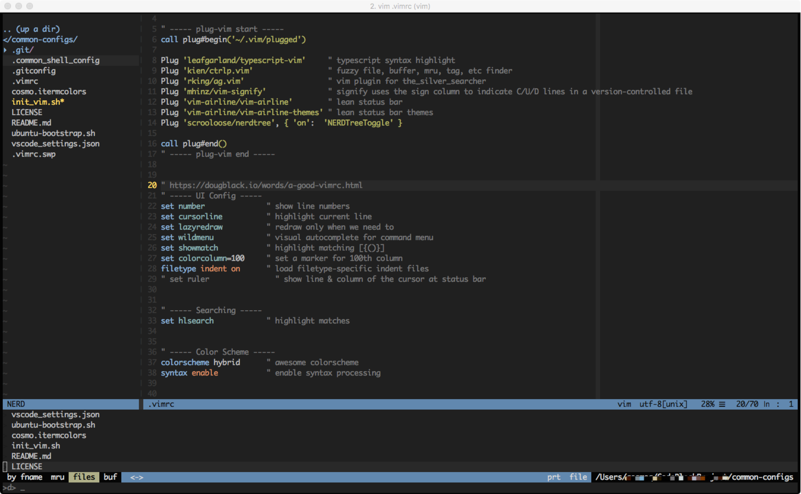

# Awesome Bootstrap Scripts

## vim

### Platform
- macOS
- Ubuntu
```bash
curl -O https://raw.githubusercontent.com/hackjutsu/common-configs/master/init_vim.sh
chmod a+x ./init_vim.sh
./init_vim.sh
```
